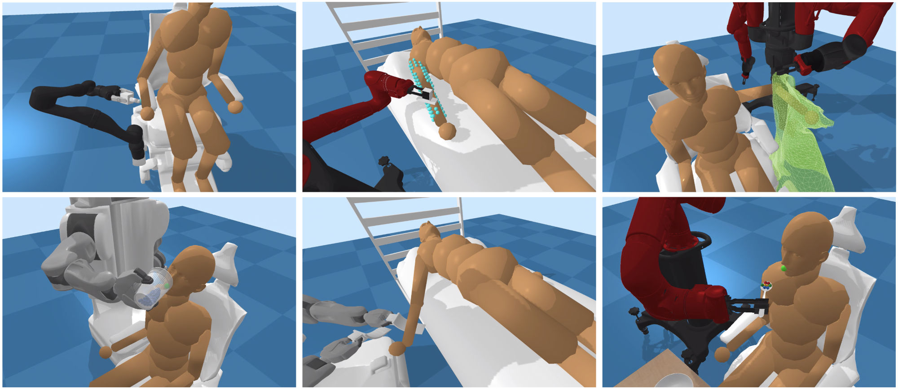
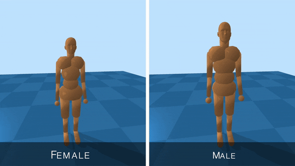
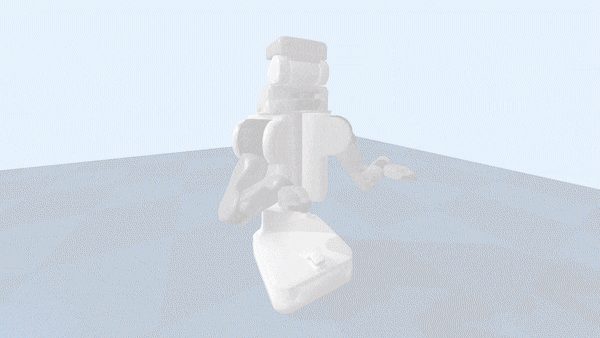

# Assistive Gym

Assistive Gym is a physics-based simulation framework for physical human-robot interaction and robotic assistance.

Assistive Gym is integrated into the OpenAI Gym interface, enabling the use of existing reinforcement learning and control algorithms to teach robots how to interact with people. 



### Paper
A paper on Assistive Gym can be found at https://arxiv.org/pdf/1910.04700.pdf

Z. Erickson, V. Gangaram, A. Kapusta, C. K. Liu, and C. C. Kemp, “Assistive Gym: A Physics Simulation Framework for Assistive Robotics”, IEEE International Conference on Robotics and Automation (ICRA), 2020.
```
@article{erickson2020assistivegym,
  title={Assistive Gym: A Physics Simulation Framework for Assistive Robotics},
  author={Erickson, Zackory and Gangaram, Vamsee and Kapusta, Ariel and Liu, C. Karen and Kemp, Charles C.},
  journal={IEEE International Conference on Robotics and Automation (ICRA)},
  year={2020}
}
```

## Install
### Google Colab
[Try out Assistive Gym in Google Colab](https://colab.research.google.com/drive/1PAY5HnLKRB-TBsPaevRr6myMfpVt_yzF?usp=sharing)
Assistive Gym is fully supported in Google Colab (online Python Jupyter notebook). Click on the link above for an example. Everything runs online, so you won't need to install anything on your local machine!

All of the available Google Colab examples are listed on the [Wiki-Google Colab](https://github.com/Healthcare-Robotics/assistive-gym/wiki/7.-Google-Colab)

### Basic install (if you just want to use existing environments without changing them)
```bash
pip3 install --upgrade pip
pip3 install git+https://github.com/Healthcare-Robotics/assistive-gym.git
```

We recommend using Python 3.6 (although other Python 3.x versions may still work). You can either download [Python 3.6 here](https://www.python.org/downloads/), or use [pyenv](https://github.com/pyenv/pyenv) to install Python 3.6 in a local directory, e.g. `pyenv install 3.6.5; pyenv local 3.6.5`

### Full installation (to edit/create environments) using a python virtual environment
We encourage installing Assistive Gym and its dependencies in a python virtualenv.  
A detailed description of each installation step can be found in the [Install Guide](https://github.com/Healthcare-Robotics/assistive-gym/wiki/1.-Install).  
Installation instructions for Windows can also be found in the [Install Guide](https://github.com/Healthcare-Robotics/assistive-gym/wiki/1.-Install#installing-on-windows).
```bash
python3 -m pip install --user virtualenv
python3 -m venv env
source env/bin/activate
pip3 install --upgrade pip
git clone https://github.com/Healthcare-Robotics/assistive-gym.git
cd assistive-gym
pip3 install -e .
```

## Getting Started
We provide a [10 Minute Getting Started Guide](https://github.com/Healthcare-Robotics/assistive-gym/wiki/3.-Getting-Started) to help you get familiar with using Assistive Gym for assistive robotics research.

You can visualize the various Assistive Gym environments using the environment viewer.  
A full list of available environment can be found [Here (Environments)](https://github.com/Healthcare-Robotics/assistive-gym/wiki/2.-Environments).
```bash
python3 -m assistive_gym --env "FeedingJaco-v1"
```

We provide pretrained control policies for each robot and assistive task.  
See [Running Pretrained Policies](https://github.com/Healthcare-Robotics/assistive-gym/wiki/4.-Running-Pretrained-Policies) for details on how to run a pretrained policy.

See [Training New Policies](https://github.com/Healthcare-Robotics/assistive-gym/wiki/5.-Training-New-Policies) for documentation on how to train new control policies for Assistive Gym environments.

Finally, [Creating a New Assistive Environment](https://github.com/Healthcare-Robotics/assistive-gym/wiki/6.-Creating-a-New-Assistive-Environment) discusses the process of creating an Assistive Gym environment for your own human-robot interaction tasks.

## New Features in v1.0
### Clean code syntax
#### v1.0 example (getting robot left end effector velocity)
```python
end_effector_velocity = self.robot.get_velocity(self.robot.left_end_effector)
```
#### Old v0.1
```python
end_effector_velocity = p.getLinkState(self.robot, 76 if self.robot_type=='pr2' else 19 if self.robot_type=='sawyer' else 48 if self.robot_type=='baxter' else 8, computeForwardKinematics=True, computeLinkVelocity=True, physicsClientId=self.id)[6]
```

### Support for mobile bases (mobile manipulation)
For robots with mobile bases, locomotion control is now supported. Ground frictions and slip can be dynamically changed for domain randomization.

Reference this [Google Colab notebook](https://colab.research.google.com/drive/1pfYvTcHK1LF8M9p4Gp31S8SziWIiN0Sq?usp=sharing) for an example of mobile base control.

### Support for the Stretch and PANDA robots

### Multi-robot control support

### Integration with iGibson

### Static human mesh models (with SMPL-X)


## Features
### Human and robot models 
Customizable female and male human models (default body sizes and weights matching 50th percentile humans).  
40 actuated human joints (head, torso, arms, waist, and legs)  
&nbsp;  
  
&nbsp;  
Four collaborative robots (PR2, Jaco, Baxter, Sawyer).  
&nbsp;  

### Realistic human joint limits
Building off of prior research, Assistive Gym provides a model for realistic pose-dependent human joint limits.  
&nbsp;  

### Robot base pose optimization
A robot's base pose can greatly impact the robot’s ability to physically assist people.  
We provide a baseline method using joint-limit-weighted kinematic isotopy (JLWKI) to select good base poses near a person.  
With JLWKI, the robot chooses base poses (position and yaw orientation) with high manipulability near end effector goals.  
&nbsp;  

### Human preferences
During assistance, a person will typically prefer for the robot not to spill water on them, or apply large forces to their body.  
Assistive Gym provides a baseline set of human preferences unified across all tasks, which are incorporated directly into the reward function.
This allows robots to learn to provide assistance that is consist with a person's preferences.  
&nbsp;  


Refer to [the paper](https://arxiv.org/abs/1910.04700) for details on features in Assistive Gym.
